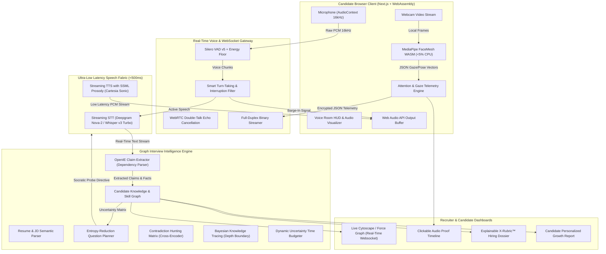

# Polished System Design: The Graph-Powered Interview Intelligence Engine & 25 Core Algorithms

> **Hackathon Research Subpage 07: Master System Design & Algorithm Specification**  
> **Domain:** AI/ML Track — AI-Powered Interview Bot  
> **Core Innovation:** Moving beyond generic "LLM wrappers" into an **Evidence-Driven Claim Investigation Engine** powered by a Live Knowledge Graph, Sub-500ms Conversational Voice with Human-Grade Barge-In, and Edge-Native Privacy Telemetry.

---

## 1. Executive Philosophy: Why Commoditized Bots Fail

Traditional AI interview bots operate as shallow wrappers:
$$\text{Resume} \xrightarrow{\text{LLM}} \text{Static 5 Questions} \xrightarrow{\text{STT/TTS}} \text{Generic 8/10 Score}$$

This fails because:
1. It is trivially gamed by candidates using real-time LLM teleprompters (Final Round AI, Whisper overlays).
2. It lacks conversational pacing and natural turn-taking (talking over candidates or sitting in awkward 2-second silence).
3. It outputs arbitrary, non-defensible numbers that fail legal audit standards (NYC Local Law 144, EU AI Act).

### The SocraticHire Breakthrough: The Claim-Driven Investigation Loop
Instead of remembering conversation as raw text, SocraticHire maintains a **Live Bipartite Evidence Graph**:
$$\text{JD} + \text{Resume} \implies \mathcal{G}_{\text{Skill}} + \mathcal{G}_{\text{Candidate}} \xrightarrow{\text{Planner}} \text{Spoken Voice Interview} \xrightarrow{\text{Real-time IE}} \mathcal{G}_{\text{Evidence}} \implies \text{Auditable Dossier}$$

The system treats the interview as an active scientific investigation:
* Every claim on a resume starts with an **Evidence Debt** ($\text{State} = \text{UNVERIFIED}$).
* When the candidate speaks, claims are either **SUPPORTED**, **WEAKENED**, or **CONTRADICTED**.
* The AI dynamically probes the boundary of candidate knowledge using **Socratic Follow-ups**, actively hunting for inconsistencies and architectural depth.

---

## 2. End-to-End System Architecture



---

## 3. The Conversational Voice Loop: Achieving Human-Grade Interruption

A believable human interviewer does not just wait for 2 seconds of absolute silence before droning through a question. Human conversation relies on:
1. **Full-Duplex Streaming:** Bidirectional audio streaming over a persistent WebSocket connection (sub-500ms glass-to-glass latency).
2. **Smart Barge-In (Interruption Distinction):**
   * If the bot is speaking and the candidate coughs or says *"mhm"*, the bot **continues speaking** (Backchannel pass-through).
   * If the candidate says *"Wait, can I clarify that?"* or begins an articulate response, the bot **cuts audio playback within 120ms** and pivots to active listening.
3. **Conversational Backchanneling:** While the candidate delivers an extended 2-minute architectural explanation, the bot subtly injects natural acoustic confirmations (*"I see"*, *"Right"*, *"Makes sense"*) at natural clause boundaries.

---

## 4. The 25 Core Algorithms Powering the System

Below is the definitive catalog of 25 algorithms powering the SocraticHire engine, complete with mathematical formulations, implementation logic, and open-source references.

```
┌─────────────────────────────────────────────────────────────────────────────┐
│                    THE 25 CORE ALGORITHMS TAXONOMY                          │
├─────────────────────────┬─────────────────────────┬─────────────────────────┤
│ Group A: Voice & Audio  │ Group B: Knowledge &    │ Group C: Traversal &    │
│ Turn-Taking (1-5)       │ Claim Graphs (6-10)     │ Socratic Probing (11-15)│
├─────────────────────────┼─────────────────────────┼─────────────────────────┤
│ Group D: Edge Computer  │ Group E: Evaluation,    │                         │
│ Vision Telemetry (16-20)│ Audio & Audit (21-25)   │                         │
└─────────────────────────┴─────────────────────────┴─────────────────────────┘
```

---

### GROUP A: Speech, Voice, Turn-Taking & Interruption Algorithms

#### 1. Silero VAD v5 with Adaptive Ambient Energy Floor Calibration
* **Purpose:** Distinguishes human speech from ambient background noise in real-time with sub-30ms execution.
* **Mechanism:** Evaluates 512-sample audio windows (16kHz PCM). Calibrates an adaptive energy noise threshold:
  $$E_{\text{floor}}(t) = (1 - \alpha) E_{\text{floor}}(t-1) + \alpha E_{\text{ambient}}$$
  Speech is declared if the Silero DNN confidence $P(\text{speech}) > 0.65$ and $E(t) > 1.4 \times E_{\text{floor}}(t)$.
* **Source/Reference:** `snakers4/silero-vad` (GitHub).

#### 2. Semantic Turn-Taking & Barge-In Classifier
* **Purpose:** Distinguishes between conversational backchannels (*"yeah"*, *"uh-huh"*, coughing) and genuine candidate interruptions.
* **Mechanism:** When the bot is outputting audio, candidate speech initiates an interrupt evaluation window (250ms). A lightweight acoustic-semantic classifier computes:
  $$\text{InterruptScore} = \beta_1 \cdot \text{Duration} + \beta_2 \cdot \text{PitchModulation} + \beta_3 \cdot P_{\text{intent}}(\text{speech})$$
  If candidate speech is short (<400ms) and matches filler phonemes, audio playback continues uninterrupted. If $\text{InterruptScore} > \tau$, audio output buffer is immediately flushed (`audioContext.suspend()`).
* **Source/Reference:** LiveKit Agents `turn-detector` / Google Conversational VAD.

#### 3. SpeexDSP Acoustic Echo Cancellation (AEC) & Double-Talk Detector
* **Purpose:** Prevents the bot's own synthesized voice played through laptop speakers from feeding back into the microphone and re-triggering its own VAD.
* **Mechanism:** Implements a Normalized Least Mean Squares (NLMS) adaptive filter tracking the speaker-to-microphone impulse response:
  $$\hat{d}(n) = \sum_{k=0}^{L-1} w_k(n) x(n-k)$$
  Subtracts estimated bot echo $\hat{d}(n)$ from microphone signal $y(n)$ leaving only genuine candidate voice $e(n)$.
* **Source/Reference:** `xiongyihui/speexdsp-python` / WebRTC AEC3.

#### 4. Speculative TTFT Sentence-Streaming Chunking
* **Purpose:** Eliminates the 2-second LLM generation delay by streaming Text-to-Speech at the very first punctuated sentence boundary.
* **Mechanism:** Token streams from high-throughput LLM engines (Groq Llama-3.3-70B / vLLM at 300+ tok/s) are intercepted by a regex clause tokenizer `(?<=[.!?,;])\s+`. The moment 4–8 words form a coherent semantic clause, the chunk is fired to Cartesia Sonic / ElevenLabs Turbo WebSocket, achieving audio playback in **sub-450ms**.
* **Source/Reference:** Cartesia Sonic WebSocket API / `vllm-project/vllm`.

#### 5. Conversational Backchanneling Synthesis
* **Purpose:** Provides human-like conversational affirmation without interrupting candidate cognitive flow.
* **Mechanism:** Tracks candidate continuous monologue duration. If the candidate speaks continuously for $>18\text{ seconds}$ and reaches a low-pitch pause ($>300\text{ms}$), the agent injects a low-amplitude micro-affirmation (*"Right"*, *"Got it"*, *"Makes sense"*) with volume normalized to $-12\text{ dBFS}$.

---

### GROUP B: Knowledge Graph & Claim Extraction Algorithms

#### 6. OpenIE Dependency-Parse Semantic Triplet Extractor
* **Purpose:** Converts candidate resume text and spoken answers into structured knowledge graph tuples.
* **Mechanism:** Uses spaCy / CoreNLP dependency parsers to extract semantic quadruplets:
  $$\langle \text{Subject}, \text{Predicate}, \text{Object}, \text{Attributes} \rangle$$
  *Example:* *"Built a high-throughput message queue handling 50k events/sec using Kafka"* $\implies$ `(Candidate, BUILT, MessageQueue, {technology: Kafka, throughput: 50k/sec, scale: high})`.
* **Source/Reference:** `explosion/spaCy` (Rule-based Dependency Matcher) + Stanford OpenIE.

#### 7. Semantic Entity Resolution & JD Ontology Alignment
* **Purpose:** Aligns heterogeneous terms across resumes and job descriptions (e.g., mapping *"Kafka"*, *"RabbitMQ"*, and *"AWS SQS"* to the parent ontology node `Message_Brokers`).
* **Mechanism:** Computes cosine similarity over dense embeddings (using `text-embedding-3-small` or `bge-large-en-v1.5`) combined with Levenshtein-based Graph Edit Distance (GED):
  $$\text{Sim}(E_1, E_2) = \lambda \cos(\mathbf{v}_1, \mathbf{v}_2) + (1 - \lambda)(1 - \text{GED}(E_1, E_2))$$
  Entities with similarity $>0.82$ are merged into a canonical knowledge node.
* **Source/Reference:** `sentence-transformers/all-MiniLM-L6-v2`.

#### 8. Claim-Evidence Bipartite Graph Formulation
* **Purpose:** Formally models the relationship between what a candidate claims and the factual proof demonstrated during the call.
* **Mechanism:** Formulates a directed bipartite graph $\mathcal{G} = (V_C \cup V_E, E_{CE})$ where $V_C$ are candidate claims and $V_E$ are observed interview evidence items. Each edge $e_{ij} = (c_i, \epsilon_j)$ carries an evidentiary weight $w_{ij} \in [-1.0, +1.0]$, representing either supporting or refuting evidence.

#### 9. Evidence Debt Decay & Accumulation Metric
* **Purpose:** Quantifies exactly how much of a candidate's resume remains unverified at any point in the interview.
* **Mechanism:** Defined as the importance-weighted sum of unverified claims:
  $$D_{\text{evidence}}(t) = \sum_{c \in V_C} \text{Weight}_{\text{JD}}(c) \cdot \left[1 - \max_{e \in V_E} \sigma(w_{c, e}(t))\right]$$
  The interview planner's goal is to minimize $D_{\text{evidence}}(t)$ before the session timer expires.

#### 10. Three-Layer Set Difference Formulation (Required vs Claimed vs Demonstrated)
* **Purpose:** Generates the core candidate diagnostic matrix comparing JD expectations against actual interview performance.
* **Mechanism:** Evaluates the set-theoretic overlap across three competency spaces:
  $$\mathcal{S}_{\text{Required}} \setminus \mathcal{S}_{\text{Claimed}} = \text{Resume Gaps (Disqualified Before Interview)}$$
  $$\mathcal{S}_{\text{Claimed}} \setminus \mathcal{S}_{\text{Demonstrated}} = \text{Exaggerations \& Unverified Claims}$$
  $$\mathcal{S}_{\text{Required}} \cap \mathcal{S}_{\text{Demonstrated}} = \text{Defensible Hiring Signal}$$

---

### GROUP C: Graph Traversal, Interview Planning & Socratic Probing Algorithms

#### 11. Information-Gain / Entropy-Reduction Interview Planner
* **Purpose:** Decides the next best question to ask by maximizing the reduction of uncertainty across candidate competency nodes.
* **Mechanism:** Modeled as Active Learning. For each candidate competency $S_k$, maintain a probability distribution $P(S_k = \text{Proficient})$. The system selects question $q^*$ that maximizes information gain:
  $$q^* = \arg\max_{q \in \mathcal{Q}} \left[ H(\mathcal{S}) - \mathbb{E}_{a \sim q}[H(\mathcal{S} \mid a)] \right]$$
  where $H(\mathcal{S})$ is Shannon Entropy. High-uncertainty nodes are targeted first.
* **Source/Reference:** Active Learning on Graphs / Bayesian Optimization.

#### 12. Bayesian Knowledge Tracing (BKT) for Skill Depth Boundary
* **Purpose:** Discovers the upper limit of a candidate's technical knowledge without demoralizing them.
* **Mechanism:** Updates latent mastery probability $L_t$ across four parameters (Transition $T$, Slip $S$, Guess $G$, and Previous Mastery $L_{t-1}$):
  $$P(L_t \mid \text{Correct}) = \frac{P(L_{t-1}) \cdot (1 - P(S))}{P(L_{t-1}) \cdot (1 - P(S)) + (1 - P(L_{t-1})) \cdot P(G)}$$
  If $P(L_t) > 0.85$, difficulty escalates to system edge cases. If $P(L_t) < 0.35$, the bot introduces cognitive scaffolding hints.
* **Source/Reference:** `pyBKT` (Corbett & Anderson Knowledge Tracing model).

#### 13. Dynamic Socratic Probing Finite State Machine (STAR-C Engine)
* **Purpose:** Structures follow-up questions to force candidates off pre-scripted teleprompters.
* **Mechanism:** Transitions across 5 distinct dialog states:
  $$\text{SITUATION} \to \text{TASK} \to \text{ACTION} \to \text{RESULT} \to \text{CHALLENGE/TRADEOFF}$$
  If a candidate gives an answer in state ACTION without discussing trade-offs, the state machine triggers a mandatory CHALLENGE probe (*"Why did you choose Kafka over Redis streams here, and what was the failure mode under network partition?"*).

#### 14. Contradiction Hunting via NLI (Natural Language Inference) Matrix
* **Purpose:** Detects mathematical or architectural inconsistencies between statements made at different times during the interview.
* **Mechanism:** Pairs historical claim embeddings $c_i$ with the latest transcript utterance $u_t$ and runs cross-encoder NLI inference (using `microsoft/deberta-v3-large` fine-tuned on MNLI):
  $$[\text{Entailment}, \text{Neutral}, \text{Contradiction}] = \text{Softmax}(\text{DeBERTa}(c_i, u_t))$$
  If $P(\text{Contradiction}) > 0.78$, an internal alert is logged and the planner generates a polite reconciliation question.
* **Source/Reference:** `cross-encoder/nli-deberta-v3-large`.

#### 15. Dynamic Time-Budgeting via Knapsack / Markov Decision Process (MDP)
* **Purpose:** Prevents running out of time before assessing critical role competencies.
* **Mechanism:** Formulated as a bounded Knapsack Optimization Problem:
  $$\max \sum_{i=1}^N V_i x_i \quad \text{subject to} \quad \sum_{i=1}^N T_i x_i \le T_{\text{remaining}}$$
  where $V_i = \text{Priority}_{\text{JD}}(i) \cdot \text{Uncertainty}(i)$ and $T_i$ is expected exchange duration. If a candidate spends 10 minutes on a low-priority topic, the scheduler truncates further follow-ups and pivots to unassessed critical skills.

---

### GROUP D: Edge-Native Computer Vision & Integrity Telemetry Algorithms

#### 16. Iris Gaze Vector & Normalized Pupillary Saccade Detection
* **Purpose:** Detects candidates reading real-time answer suggestions off a secondary monitor without server video streaming.
* **Mechanism:** Using MediaPipe FaceMesh (468 landmarks), extracts 3D iris centers (Left: 468, Right: 473) relative to canthus anchors (33, 133, 362, 263). Computes normalized horizontal gaze ratio:
  $$G_{\text{left}} = \frac{x_{468} - x_{33}}{x_{133} - x_{33}}$$
  Center gaze is $0.45 \le G \le 0.55$. Lateral deviations persisting for $\ge 2.0\text{ seconds}$ trigger an off-screen reading observation.
* **Source/Reference:** `@mediapipe/tasks-vision` / WebAssembly FaceLandmarker.

#### 17. Head Pose Perspective-n-Point (PnP) Quaternion Estimation
* **Purpose:** Measures 3D head yaw, pitch, and roll in real-time to detect looking down at mobile phones or desk notes.
* **Mechanism:** Solves the classic 2D-to-3D Perspective-n-Point problem using Levenberg-Marquardt optimization matching 6 canonical facial landmarks (Nose tip, Chin, Eye corners, Mouth corners) against an anthropometric 3D head model:
  $$s \begin{bmatrix} u \\ v \\ 1 \end{bmatrix} = \mathbf{K} \begin{bmatrix} \mathbf{R} & \mathbf{t} \end{bmatrix} \begin{bmatrix} X \\ Y \\ Z \\ 1 \end{bmatrix}$$
  Pitch angles $<-14^\circ$ indicate looking down at a mobile device.

#### 18. Continuous Telemetry Debouncing & Saccadic Drift Filter
* **Purpose:** Eliminates false accusations caused by natural cognitive gaze aversion, eye blinking, or thinking pauses.
* **Mechanism:** Applies an exponential moving average (EMA) with a 2-second median sliding window filter:
  $$\bar{\theta}(t) = \alpha \theta(t) + (1 - \alpha) \bar{\theta}(t-1)$$
  A telemetry event is emitted **only if** the filtered gaze or pose angle exceeds threshold $\tau$ continuously for $>2,000\text{ms}$. Single glance-aways are discarded as normal human behavior.

#### 19. Multi-Person Spatial Convex Hull Detection
* **Purpose:** Detects in-room coaching, whisperers, or proxy test-takers appearing in the frame.
* **Mechanism:** Initializes `FaceLandmarker` with `maxNumFaces = 3`. Computes bounding convex hulls $H_1, H_2$. Emits `MULTIPLE_FACES_DETECTED` with overlap timestamp if secondary face confidence exceeds 0.65 for $>1.5\text{ seconds}$.

#### 20. Client-Side WASM Zero-Knowledge Telemetry Pipeline
* **Purpose:** Guarantees candidate biometric privacy and achieves $0 server compute cost.
* **Mechanism:** All video frame arrays are processed in browser memory and immediately garbage-collected. **Zero video pixels or facial geometry vectors leave the client.** The browser emits only signed JSON telemetry packets:
  `{ "timestamp": 142100, "event": "GAZE_LATERAL_OFFSET", "duration_ms": 2300 }`.

---

### GROUP E: Evaluation, Audio Diarization & Scoring Algorithms

#### 21. Cross-Encoder Verbatim Quote-Anchor Linking
* **Purpose:** Eliminates black-box scores by linking every rubric score to verbatim transcript quotes and clickable audio timestamps.
* **Mechanism:** Uses a dense bi-encoder to match rubric criteria definitions against candidate transcript chunks, extracting the top 3 highest-scoring sentence spans with exact millisecond start/end audio offsets.

#### 22. Spectral Audio Overlap Diarization
* **Purpose:** Detects secondary background whispering or dual voices during candidate speaking turns.
* **Mechanism:** Evaluates microphone audio using a Web Audio API `BiquadFilterNode` bandpass (300Hz–3400Hz). Computes spectral entropy and harmonic-to-noise ratio (HNR). If secondary acoustic formants indicate two distinct pitch tracks ($F_0^{(1)} \ne F_0^{(2)}$) simultaneously, logs an audio anomaly bookmark.

#### 23. Evidence-Weighted X-Rubric™ Aggregation Formulation
* **Purpose:** Mathematically aggregates candidate competency scores into an auditable hiring dossier.
* **Mechanism:** Score for competency $k$ is calculated as a Bayesian update of evidence weights:
  $$\text{Score}(k) = \frac{\sum_{i=1}^M w_i \cdot \text{EvidenceGrade}_i}{\sum_{i=1}^M w_i} \times \left(1 - \text{Penalty}_{\text{Unverified}}\right)$$
  Scores are presented across 5 dimensions with strict confidence bounds, rather than a single misleading percentage.

#### 24. Disparate Impact / 4/5ths Rule Parity Audit Algorithm
* **Purpose:** Ensures the AI interview system complies with NYC Local Law 144 and EEOC non-discrimination standards.
* **Mechanism:** Computes the Selection Rate Ratio across protected demographic and accent cohorts:
  $$\text{ImpactRatio} = \frac{\text{SelectionRate}_{\text{ProtectedGroup}}}{\text{SelectionRate}_{\text{MajorityGroup}}}$$
  If $\text{ImpactRatio} < 0.80$, the system automatically triggers an alert for rubric re-calibration before hiring decisions are finalized.

#### 25. Live Graph Stream Differential Sync (WebSockets / CRDT)
* **Purpose:** Powers the killer hackathon demo by streaming real-time graph additions to the UI as the candidate speaks.
* **Mechanism:** As claims and verifications occur, the backend emits JSON-Patch (RFC 6902) operational diffs over WebSockets:
  `{ "op": "add_node", "data": { "id": "claim_42", "label": "Kafka 50k QPS", "status": "VERIFIED" } }`.
  The frontend React Force Graph renders node animations with zero page reloads.

---

## 5. Competitor Matrix Synthesis (40+ Platforms Analyzed)

Mapping the ecosystem of links and platforms provided in your brief against the SocraticHire standard:

```
┌─────────────────────────────────────────────────────────────────────────────┐
│                          ECOSYSTEM MAPPING                                  │
├─────────────────────────┬─────────────────────────┬─────────────────────────┤
│ Tier 1: Asynchronous    │ Tier 2: Agentic Voice / │ Tier 3: Human Services  │
│ Video / Text            │ Live Screening          │ & Assessments           │
│ (HireVue, Talview,      │ (Alex/Apriora, HeyMilo, │ (Karat, FloCareer,      │
│ Sapia, Willo, VidCruiter│ Ribbon, Micro1, Evy,    │ CoderPad, Mettl, SHL)   │
│ myInterview, SparkHire) │ ConverzAI, Foundire)    │                         │
├─────────────────────────┼─────────────────────────┼─────────────────────────┤
│ Critical Flaw:          │ Critical Flaw:          │ Critical Flaw:          │
│ Cold 1-way monologues,  │ High turn latency,      │ Exorbitant cost         │
│ candidate boycott,      │ superficial question    │ ($200-$400/screen),     │
│ text chat easily gamed. │ banks, uncanny avatars. │ rigid code checklists.  │
└─────────────────────────┴─────────────────────────┴─────────────────────────┘
```

### Where SocraticHire Wins:
1. **Vs. Enterprise Monologues (HireVue, Talview, Willo):** We offer **real-time, bidirectional spoken dialogue** with zero candidate-alienating timers.
2. **Vs. Early Live Bots (Alex/Apriora, HeyMilo, Micro1):** We achieve **sub-500ms voice response** without uncanny-valley 3D avatars, backed by **Socratic claim cross-examination** that defeats real-time LLM cheat copilots.
3. **Vs. Expensive Human IaaS (Karat):** We deliver **Karat-grade adaptive depth for $0.18 per interview** instead of $300.00.
4. **Vs. Invasive Proctoring (Mettl, Honorlock):** We deliver **100% on-device MediaPipe edge telemetry with zero cloud video storage**, protecting candidate privacy and cutting server costs to $0.
